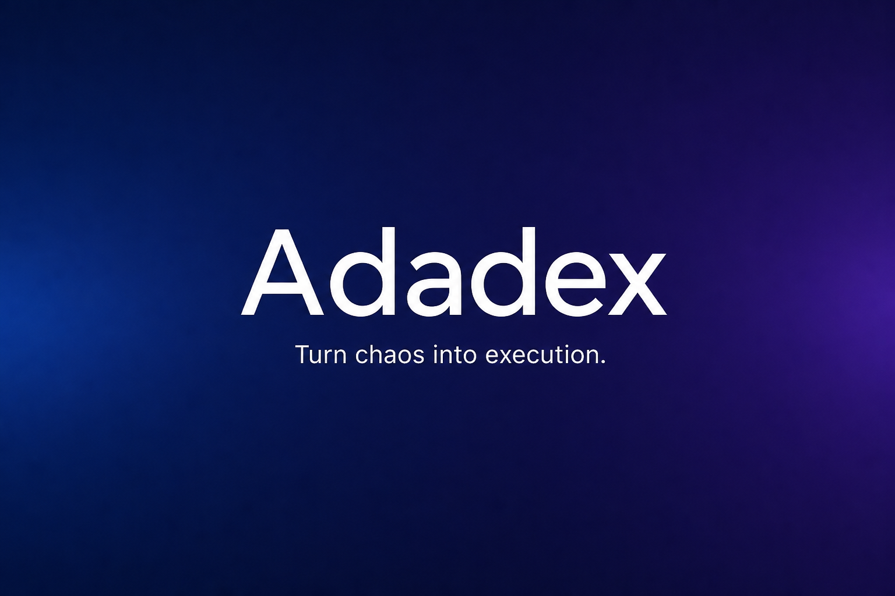
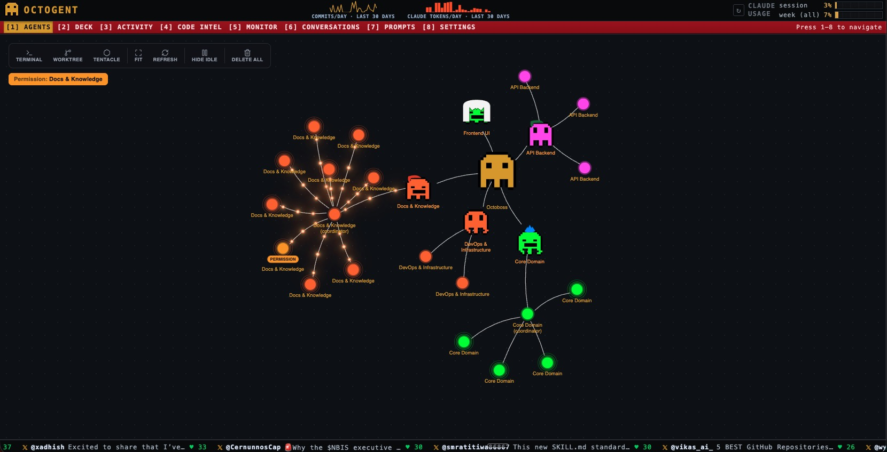
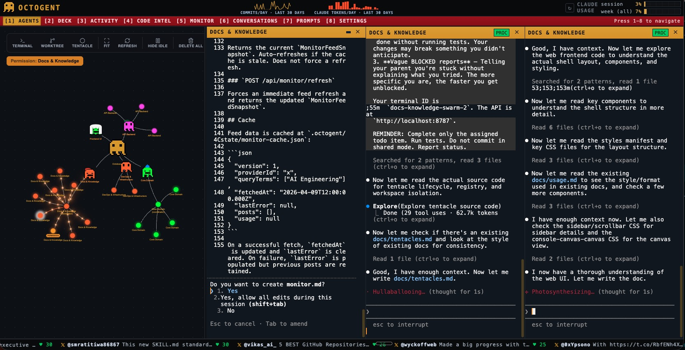
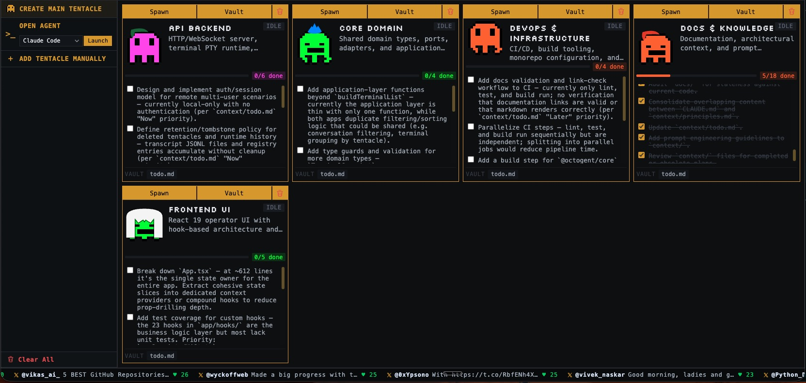
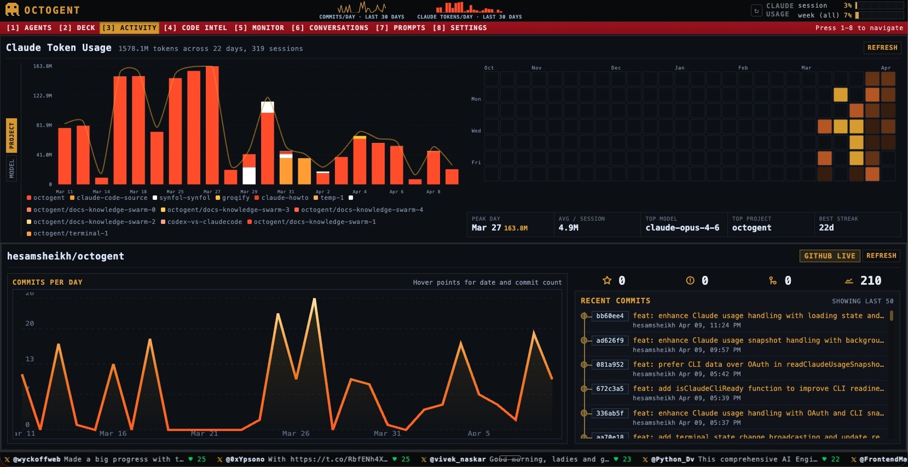
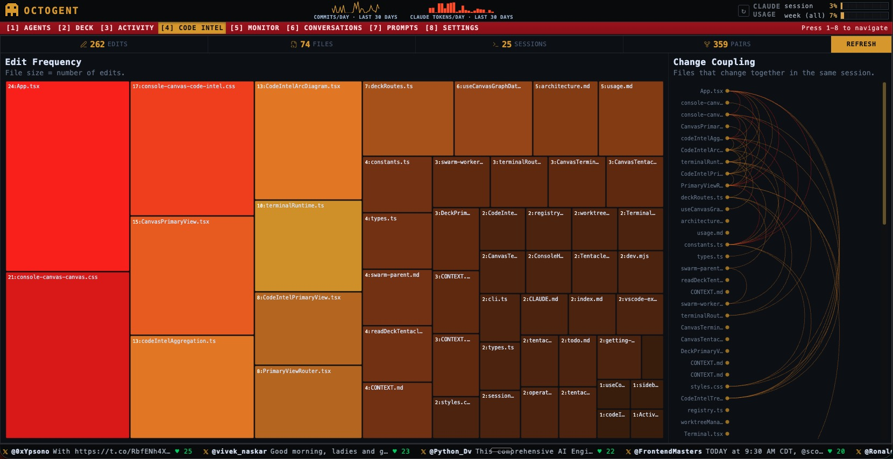
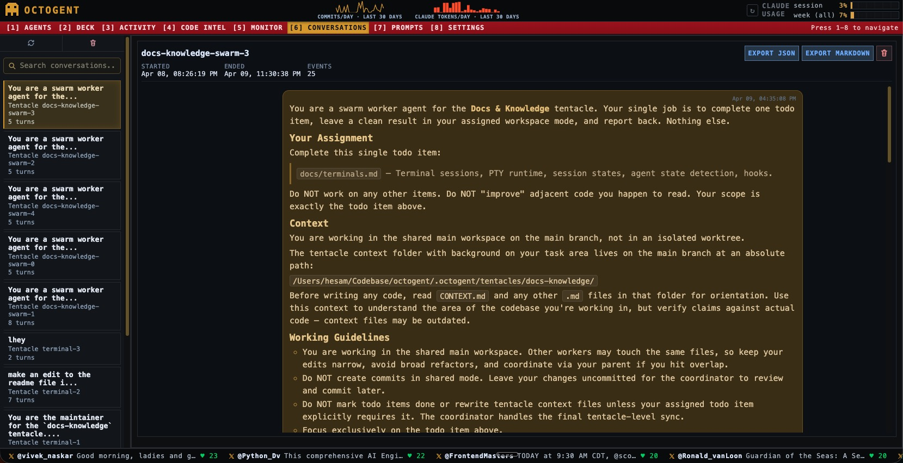

<div align="center">


<br/>
<br/>

<strong>Turn chaos into execution.</strong>
<br />
<br />

[](https://www.typescriptlang.org/)
[](https://nodejs.org/)
[](https://x.com/Hesamation)
[](https://discord.gg/vtJykN3t)

</div>

# Adadex

It's really not fun to have **ten Codex CLI sessions open at once**, constantly switching between them and trying to remember what each one was supposed to do. *Things get blurry fast* when one agent is doing documentation, another is touching the database, another is changing the API, and another is somewhere in the frontend. **Adadex** tries to fix that by giving each job its own <u>scoped context, notes, and task list</u>, while also making it possible for one agent session to **spawn other agent sessions**, assign them work, and communicate with them.

## The Vision

This repo is a personal exploration of what an AI coding environment might look like when terminal coding agents are treated as parts of a bigger orchestration layer, not the final interface by themselves. The point is not to hide **the Codex CLI** behind abstractions. The point is to make *multi-agent work less chaotic for the developer* on a real codebase.

## Screenshots

<div align="center">
<table>
<tr>
<td></td>
<td></td>
</tr>
<tr>
<td></td>
<td></td>
</tr>
<tr>
<td></td>
<td></td>
</tr>
</table>
</div>

## What Adadex Does for You

- **Creates coordinations as context layers** so agents can work with scoped markdown files instead of broad, messy chat context
- **Uses `todo.md` as an execution surface** so tasks stay visible, trackable, and ready for delegation
- **Runs multiple Codex CLI terminals** so one developer can coordinate several coding sessions at once
- **Spawns child agents from todo items** so parallel work has a concrete source of truth
- **Supports inter-agent messaging** so workers and coordinators can report completion, blockers, and handoff notes
- **Keeps agent-facing context in files** so the system is more durable than a single prompt thread
- **Provides a local API and UI** for terminal lifecycle, persistence, websocket transport, and orchestration

A **coordination** is a folder under `.adadex/coordinations/<coordination-id>/` that holds agent-readable markdown such as `CONTEXT.md`, `todo.md`, and any extra notes needed for that slice of the codebase.

## Coordinations

A **coordination** is a scoped job container. It gives one slice of work its own files, notes, and `todo.md` so the agent is not forced to reconstruct the entire codebase context from chat history.

What it does:

- keeps context local to one area such as documentation, database work, API changes, or frontend work
- gives agents durable files they can read and update
- provides a natural source for delegation through todo items

For the full model, see [Coordination](docs/concepts/coordination.md) and [Working With Todos](docs/guides/working-with-todos.md).

## Context, Notes, and Task Lists

In Adadex, a coordination is not only a task bucket. It is also where the job keeps its local context. That can include notes about one part of the codebase, implementation details, handoff files, and a `todo.md` that tracks what still needs to happen. A coding agent can read and update those files as the work moves forward.

That means you can:

- keep documentation, database, API, or frontend work separated into different job contexts
- store the notes that help an agent understand that part of the codebase
- spawn one agent for one specific item
- break a larger job into multiple items
- launch a swarm so several agents work through the list in parallel
- use the files inside the coordination as the shared source of truth for what is done and what is left

For the full model, see [Coordination](docs/concepts/coordination.md) and [Working With Todos](docs/guides/working-with-todos.md).

## Coordinating multiple agents

One of the main ideas here is that **a terminal agent** should not only be treated as a single session waiting for a human prompt. In Adadex, one agent can coordinate other agents, assign them specific jobs, and exchange short messages with them while the human stays at the orchestration layer.

This differs from a single vendor's built-in subagent spawning, since it allows you to directly see and control what each worker agent is doing.

That means Adadex is not just a dashboard for multiple terminals. It is also a way to structure parent-worker behavior around scoped tasks and shared context files.

For the current model, see [Orchestrating Child Agents](docs/guides/orchestrating-child-agents.md) and [Inter-Agent Messaging](docs/guides/inter-agent-messaging.md).

## How It Works

Adadex separates three concerns that usually get mixed together in a pile of terminals:

1. **Context** lives in `.adadex/coordinations/<coordination-id>/`. `CONTEXT.md` explains the area, `todo.md` supplies executable work items, and extra markdown files hold notes or handoffs.
2. **Execution** lives in terminal records and PTY sessions managed by the local API. A terminal can attach to an existing coordination, and several terminals can share one coordination during swarm work.
3. **Isolation** is optional. Shared terminals run in the main workspace; worktree terminals run under `.adadex/worktrees/<worktree-id>/` on `adadex/<worktree-id>` branches.

Deck reads the coordination files directly, parses checkbox items from `todo.md`, and uses incomplete items to generate worker prompts. Agent hooks feed the API with agent state, transcript, and idle events so the UI can show more than raw terminal output.

## Quick start

<details>
<summary><strong>Local development</strong></summary>

```bash
pnpm install
pnpm dev
```

This starts the API and web app for local development.

</details>

<details open>
<summary><strong>Current install status</strong></summary>

```bash
Adadex is not published to the npm registry yet.
```

For local development:

```bash
pnpm install
pnpm dev
```

For a local global CLI install from a clone:

```bash
pnpm install
pnpm build
npm install -g .
adadex
```

The registry install flow `npm install -g adadex` will only work after the package is published.

</details>

On first run, **Adadex** creates the local `.adadex/` scaffold automatically (migrating from `.octogent/` when present), assigns a stable project ID, picks an available local API port starting at `8787`, and opens the UI unless `ADADEX_NO_OPEN=1` is set. Legacy `OCTOGENT_NO_OPEN` is still honored.

## Requirements

- Node.js `22+`
- `codex` installed for the supported agent workflow
- `git` for worktree terminals
- `gh` for GitHub pull request features
- `curl` for agent hook callbacks to this API

Startup fails if the `codex` CLI is not installed. Docs and UI assume **OpenAI Codex** as the default terminal provider.

## What persists

- `.adadex/` keeps project-local scaffold and worktrees
- `~/.adadex/projects/<project-id>/state/` keeps runtime state, transcripts, monitor cache, and metadata
- `.adadex/coordinations/<coordination-id>/` keeps the context files and todos that agents read

PTY sessions survive browser reloads during the idle grace period, but they do **not** survive an API restart. Adadex marks previously running terminal records as `stale` on startup when it cannot reattach them to a live PTY session; use `adadex terminal list`, `stop`, `kill`, and `prune` to inspect and clean them up. Adadex caps live PTY sessions at 32 by default to protect the host; set `ADADEX_MAX_TERMINAL_SESSIONS` to a positive integer to tune that limit for larger orchestration runs. Legacy `OCTOGENT_MAX_TERMINAL_SESSIONS` is still read when the Adadex-prefixed variable is unset.

## Upgrading from Octogent

This rename is a **breaking change** for scripts and clients that assumed Octogent paths or API routes.

- **On disk:** Starting the API migrates a legacy workspace when `.octogent/` exists and `.adadex/` does not: project dir `.octogent` → `.adadex`, `state/tentacles.json` → `state/coordinations.json`, `tentacles/` → `coordinations/`, and global `~/.octogent` → `~/.adadex` with the same inner renames. Prefer a backup before upgrading production checkouts.
- **HTTP API:** `/api/deck/tentacles` and nested routes are now `/api/deck/coordinations/...`. Git routes moved from `/api/tentacles/:id/git/...` to `/api/coordinations/:coordinationId/git/...`.
- **CLI and env:** Prefer the `adadex` command and `ADADEX_*` variables; many code paths still accept the former `octogent` / `OCTOGENT_*` names for compatibility.

## Docs

- [Docs Home](docs/index.md)
- [Installation](docs/getting-started/installation.md)
- [Quickstart](docs/getting-started/quickstart.md)
- [Mental Model](docs/concepts/mental-model.md)
- [Coordination](docs/concepts/coordination.md)
- [Runtime and API](docs/concepts/runtime-and-api.md)
- [Working With Todos](docs/guides/working-with-todos.md)
- [Orchestrating Child Agents](docs/guides/orchestrating-child-agents.md)
- [Inter-Agent Messaging](docs/guides/inter-agent-messaging.md)
- [CLI Reference](docs/reference/cli.md)
- [Filesystem Layout](docs/reference/filesystem-layout.md)
- [API Reference](docs/reference/api.md)
- [Experimental Features](docs/reference/experimental-features.md)
- [Troubleshooting](docs/reference/troubleshooting.md)
- [Contributing](CONTRIBUTING.md)

## Contributor setup

Adadex is not actively reviewing pull requests right now. If you still open one and any code was written with AI, disclose which coding agent and model were used. For contributor workflow and expectations, see [CONTRIBUTING.md](CONTRIBUTING.md).
