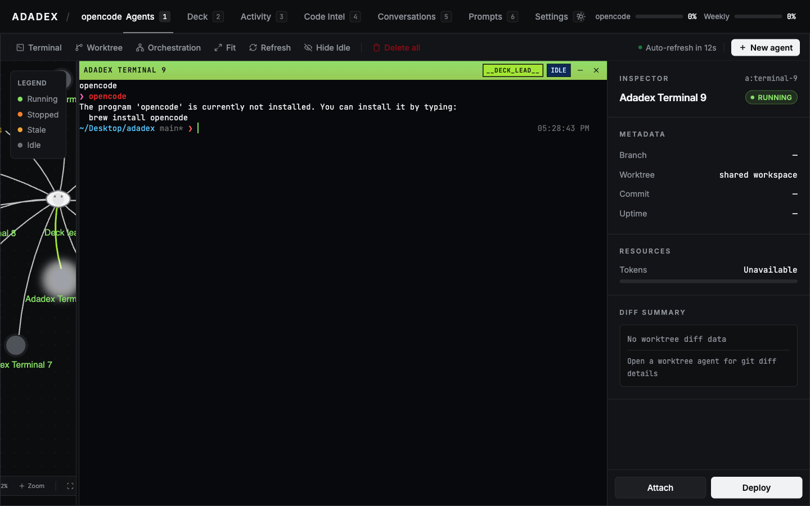
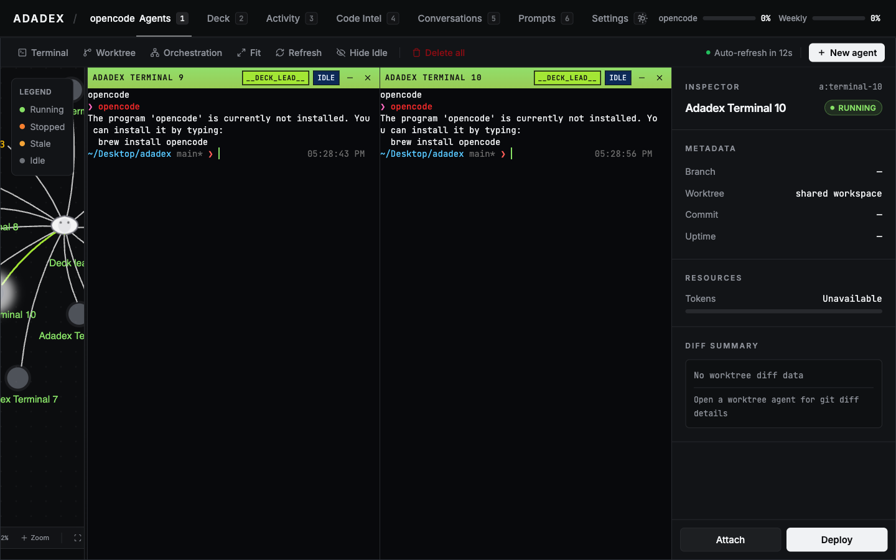
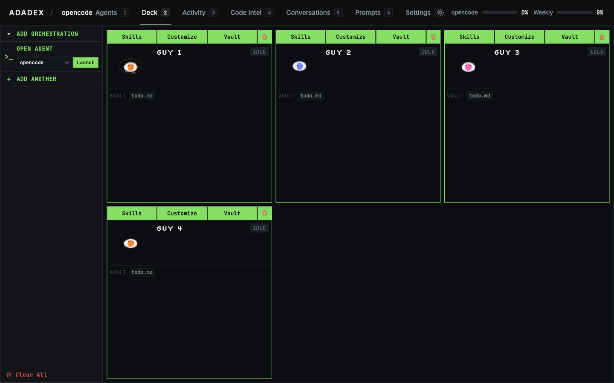
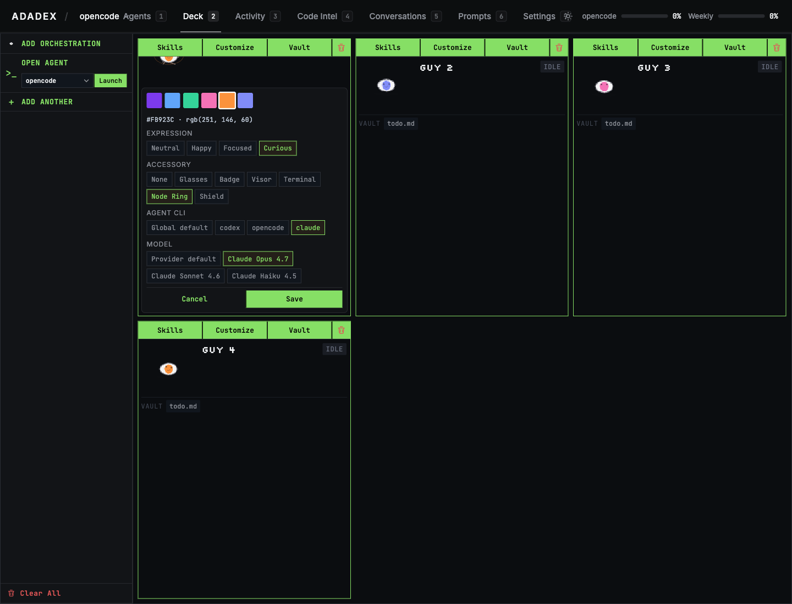
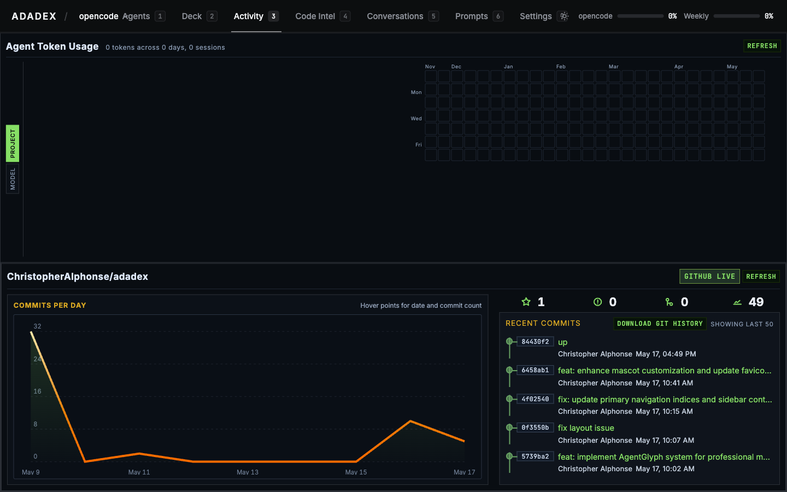
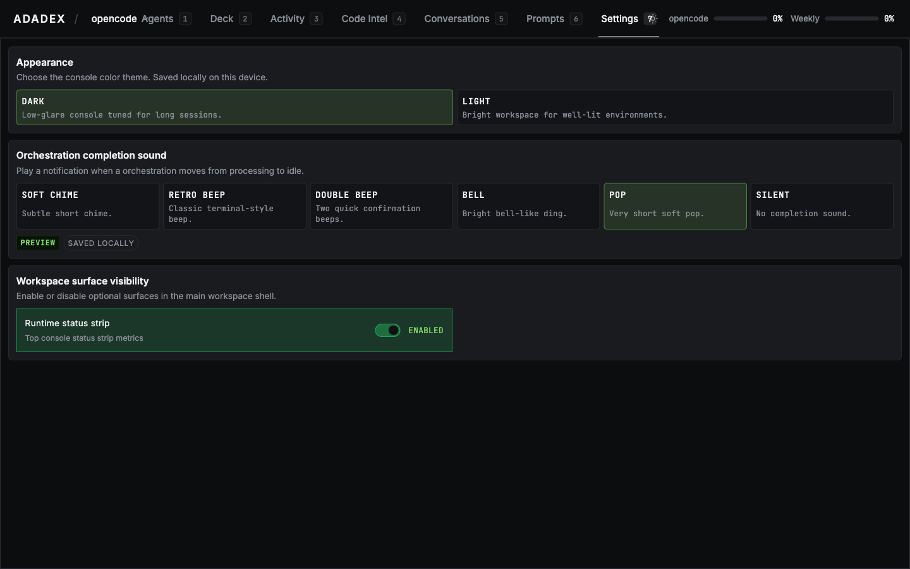

<div align="center">


**Turn chaos into execution.**

[](https://www.typescriptlang.org/)
[](https://nodejs.org/)

<details>
<summary><strong>Docs</strong></summary>
<br>

[Docs Home](docs/index.md) &nbsp;|&nbsp;
[Installation](docs/getting-started/installation.md) &nbsp;|&nbsp;
[Quickstart](docs/getting-started/quickstart.md) &nbsp;|&nbsp;
[Mental Model](docs/concepts/mental-model.md) &nbsp;|&nbsp;
[Coordination](docs/concepts/coordination.md) &nbsp;|&nbsp;
[Runtime and API](docs/concepts/runtime-and-api.md) &nbsp;|&nbsp;
[Working With Todos](docs/guides/working-with-todos.md) &nbsp;|&nbsp;
[Orchestrating Child Agents](docs/guides/orchestrating-child-agents.md) &nbsp;|&nbsp;
[Inter-Agent Messaging](docs/guides/inter-agent-messaging.md) &nbsp;|&nbsp;
[CLI Reference](docs/reference/cli.md) &nbsp;|&nbsp;
[Filesystem Layout](docs/reference/filesystem-layout.md) &nbsp;|&nbsp;
[API Reference](docs/reference/api.md) &nbsp;|&nbsp;
[Experimental Features](docs/reference/experimental-features.md) &nbsp;|&nbsp;
[Troubleshooting](docs/reference/troubleshooting.md)

</details>

</div>

Adadex is a web-first orchestration layer for running multiple coding agents in parallel. Instead of juggling many terminal sessions and losing track of what each one is doing, Adadex gives each job its own scoped context, task list, and notes. One agent session can spawn others, assign them work, and exchange messages with them while you stay at the orchestration layer.

> **Multi-provider support.** Adadex is no longer tied to a single coding agent CLI. You can set a global default from the header, then override it per coordination in the Customize tab. Each coordination stores its own provider and model, so when a terminal is deployed for it, it launches with exactly the right CLI and `--model` flag — no manual configuration required.

## What Adadex Does

- Creates **coordinations** as scoped job containers: each one gets its own `CONTEXT.md`, `todo.md`, and notes
- Runs multiple coding agent terminals side by side so one developer can manage several sessions at once
- Runs against **Codex**, **Claude Code**, or **opencode** — switch the global provider from the header at any time
- Lets each coordination run its own **agent CLI and model** — one coordination can use Codex with o4-mini, another Claude Code with Opus 4.7, another opencode with a different model entirely

- Spawns child agents from todo items so parallel work has a concrete source of truth
- Supports inter-agent messaging so workers and coordinators can report completion, blockers, and handoffs
- Keeps agent-facing context in files so state survives beyond a single prompt thread
- Provides a local API and UI for terminal lifecycle, persistence, WebSocket transport, and orchestration

## Screenshots

<div align="center">
<table>
<tr>
<td></td>
<td></td>
</tr>
<tr>
<td></td>
<td></td>
</tr>
<tr>
<td></td>
<td></td>
</tr>
</table>
</div>

## Requirements

- Node.js `22+`
- At least one coding agent CLI: `codex`, `claude` (Claude Code), or `opencode`
- `git` for worktree terminals
- `gh` for GitHub pull request features
- `curl` for agent hook callbacks

## Install

Adadex is not yet published to the npm registry. Use one of the options below.

**Local development:**

```bash
pnpm install
pnpm dev
```

**Global CLI from a local clone:**

```bash
pnpm install
pnpm build
npm install -g .
adadex
```

The `npm install -g adadex` registry path will work once the package is published.

## First Run

On first run, Adadex:

- creates a `.adadex/` scaffold in the project directory (migrating from `.octogent/` when present)
- assigns a stable project ID
- picks an available local API port starting at `8787`
- opens the UI in your browser

Set `ADADEX_NO_OPEN=1` to suppress the browser launch. The legacy `OCTOGENT_NO_OPEN` variable is still honored.

## How It Works

Adadex separates three concerns that usually pile up in a stack of terminals:

1. **Context** lives in `.adadex/coordinations/<coordination-id>/`. `CONTEXT.md` explains the area, `todo.md` holds executable work items, and additional markdown files hold notes and handoffs.
2. **Execution** lives in terminal records and PTY sessions managed by the local API. A terminal attaches to a coordination, and several terminals can share one coordination during swarm work.
3. **Isolation** is optional. Shared terminals run in the main workspace; worktree terminals run under `.adadex/worktrees/<worktree-id>/` on `adadex/<worktree-id>` branches.

The UI reads coordination files directly, parses checkbox items from `todo.md`, and uses incomplete items to generate worker prompts. Agent hooks feed the API with agent state, transcripts, and idle events so the UI shows more than raw terminal output.

## Coordinations

A coordination is a scoped job container. It gives one slice of work its own files, notes, and `todo.md` so an agent does not need to reconstruct the entire codebase context from chat history.

Each coordination holds:

- `CONTEXT.md`: describes the area (documentation, database, API, frontend, etc.)
- `todo.md`: checkbox items that track what is done and what remains
- any additional notes or handoff files the agent needs

One coordination can represent one focused area of the codebase. You can run a single agent against it, delegate individual items to child agents, or launch a swarm to work through the list in parallel.

For the full model, see [Coordination](docs/concepts/coordination.md) and [Working With Todos](docs/guides/working-with-todos.md).

## Coordinating Multiple Agents

In Adadex, a terminal agent is not only a single session waiting for a human prompt. One agent can coordinate others: assign them specific jobs and exchange short messages with them while the human stays at the orchestration layer.

This differs from a vendor's built-in subagent spawning because you can directly see and control what each worker agent is doing.

For the current model, see [Orchestrating Child Agents](docs/guides/orchestrating-child-agents.md) and [Inter-Agent Messaging](docs/guides/inter-agent-messaging.md).

## State and Persistence

| Location                                   | What it holds                                       |
| ------------------------------------------ | --------------------------------------------------- |
| `.adadex/`                                 | Project-local scaffold and worktrees                |
| `~/.adadex/projects/<project-id>/state/`   | Runtime state, transcripts, monitor cache, metadata |
| `.adadex/coordinations/<coordination-id>/` | Context files and todos that agents read            |

PTY sessions survive browser reloads during the idle grace period but do not survive an API restart. Adadex marks previously running terminal records as `stale` on startup when it cannot reattach them to a live PTY session. Use `adadex terminal list`, `stop`, `kill`, and `prune` to inspect and clean them up.

Adadex caps live PTY sessions at 32 by default. Set `ADADEX_MAX_TERMINAL_SESSIONS` to a positive integer to change that limit.

## Upgrading from Octogent

This rename is a breaking change for scripts and clients that used Octogent paths or API routes.

**Disk migration:** Starting the API migrates a legacy workspace when `.octogent/` exists and `.adadex/` does not. Project dir `.octogent` becomes `.adadex`; legacy filenames under `state/` are renamed to `coordinations.json`; agent-facing directories consolidate under `coordinations/`; global `~/.octogent` becomes `~/.adadex` with the same inner renames. Back up production checkouts before upgrading.

**HTTP API:** Deck resources are served under `/api/deck/coordinations/...`. Git helpers use `/api/coordinations/:coordinationId/git/...`.

**CLI and env:** Prefer the `adadex` command and `ADADEX_*` variables. Many code paths still accept the former `octogent` and `OCTOGENT_*` names for compatibility.

## Contributing

Adadex is not actively reviewing pull requests right now. If you open one and any code was written with AI, disclose the coding agent and model used. See [CONTRIBUTING.md](CONTRIBUTING.md) for full expectations.

## Credits

Adadex is a personal spin on [OCTOGENT](https://github.com/hesamsheikh/octogent) by **Hesam Sheikh**.
