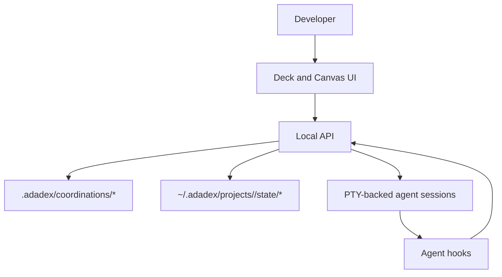

# Mental Model

This page is for the exact model behind Adadex. The README is the pitch. This page is the boundary map.

## Architectural layers

Adadex separates durable work context from live terminal execution.

- the **developer** defines boundaries, reviews output, and decides what lands
- a **coordination** is the durable job context: markdown files, todos, notes, and handoff state
- a **terminal** is the runtime record plus, when active, one PTY-backed agent session
- a **worker** is a terminal assigned to one narrower task, usually a todo item
- a **parent** is a terminal that coordinates workers and performs final review or merge work
- a **channel** is an in-memory queue used to inject short messages into live terminals

## Coordination vs terminal

These are different things.

- a **coordination** is a folder with agent-readable files
- a **terminal** is a runtime object that can attach to one coordination

Multiple terminals can point at the same coordination. Swarm workers use that property: each worker gets the same context files, but each terminal has its own identity, transcript, lifecycle state, and optional worktree.

This is why terminal IDs and coordination IDs are not interchangeable. A terminal can be named `api-runtime-swarm-2` while still using the `api-runtime` coordination context.

## Coordination vs worktree

These are also different things.

- a **coordination** is the context layer
- a **worktree** is the git isolation layer

A coordination can be used with:

- a shared-workspace terminal
- a worktree-backed terminal

The coordination decides *what the job is about*. The worktree decides *where the code changes happen*.

In shared mode, the PTY starts in the main workspace. In worktree mode, the API creates `.adadex/worktrees/<worktree-id>/` on branch `adadex/<worktree-id>` and starts the PTY there. The agent-facing context still stays in `.adadex/coordinations/<coordination-id>/`.

## What belongs in files

The durable source of truth should live in files inside the coordination.

That includes:

- context about the area
- notes and handoff information
- the current task list in `todo.md`

If another agent needs to understand the job later, the important information should already be there without depending on one old chat thread.

Deck reads these files directly. It parses the first heading and first non-empty paragraph of `CONTEXT.md` for display metadata, lists other markdown files as vault files, and parses checkbox lines in `todo.md` for progress and worker assignments.

## What belongs in runtime state

The runtime owns:

- terminal records and lifecycle state
- live PTY sessions
- websocket transport
- UI state
- transcripts
- message delivery state

That data helps the app run, but it is not the same thing as the durable job context. Terminal records survive API restarts. PTY sessions, WebSocket clients, and channel queues do not.

On startup, Adadex reloads terminal records from `coordinations.json`. If a record says it was running, Adadex cannot reattach to the old in-memory PTY, so the record is reconciled to `stale` with a lifecycle reason.

## How delegation is supposed to work

The expected flow is:

1. the developer or a parent agent defines a job boundary
2. the coordination files capture the local context
3. `todo.md` breaks the job into executable checkbox items
4. Deck or the CLI creates terminals from those items
5. each worker receives a prompt generated from the coordination context path, todo text, workspace mode, and parent terminal ID when present
6. workers report status through short channel messages and by leaving durable notes in files
7. the parent or human reviews the result and updates `todo.md`

If the boundary is vague, the orchestration gets worse. Adadex helps organize work, but it does not rescue a poorly defined job.

## What the project is actually trying to prove

- terminal coding agents can be treated as building blocks inside an orchestration layer
- file-based context is more reliable than trying to keep everything inside one long conversation
- one parent agent session can coordinate other agent sessions in a visible way
- simple task lists and short messages are enough for some useful multi-agent workflows
